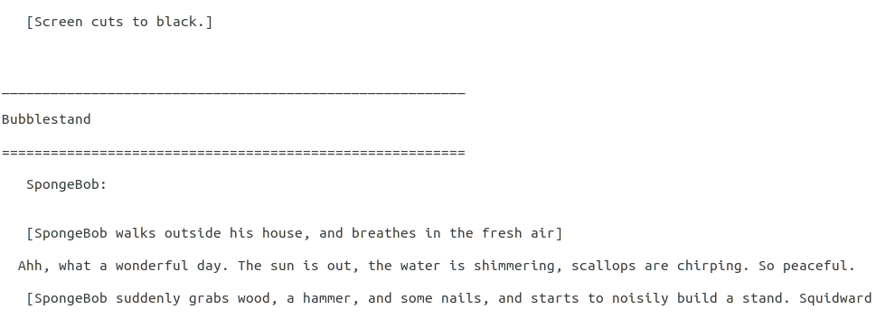

# spongebob transcript scraper
Beautiful soup web scraper that parses [the fan wiki](https://spongebob.fandom.com/wiki/List_of_transcripts) for episode transcripts.

### why? 
I want to practice NLP with pytorch and thought spongebob would be a fun test data set